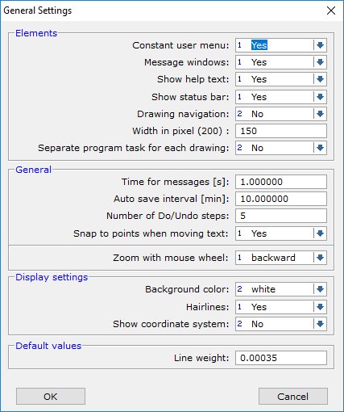
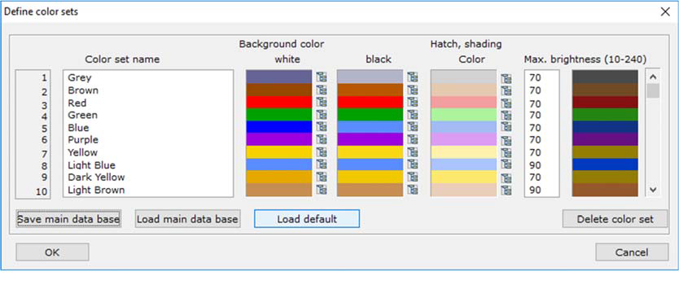
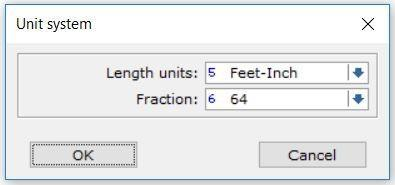

Settings 
--------

The following chapters explain how to customize drawings. Procedures for
setting up general settings, such as screen settings and paper sizes, as
well as style settings, such as drawing, dimension and text styles will
be shown.

In the end, it will be explained how to save the drawing with the
completed settings as a drawing template.

General settings
^^^^^^^^^^^^^^^^

This chapter explains how to set up display settings, color set,
toolbars, units, object snap and page layouts as well as message time,
auto save and do/undo steps.

.. note::

   1. Type 1 (File)-7(Settings)-2(General Settings)
   2. Select “yes” for showing coordinate system and confirm by clicking “OK”

Color set:
^^^^^^^^^^
This window defines the colors used in D-CAD-L 2D. Color sets always consist of two colors. One for white background color and one for black background color. The background color can be changed in the General settings.
New color sets can be added by entering a name and selecting the color.

Screen settings window
^^^^^^^^^^^^^^^^^^^^^^

This window defines the colors used in D-CAD-L 2D. Color sets always
consist of two colors. One for white background color and one for black
background color. The background color can be changed in the General
settings.

New color sets can be added by entering a name and selecting the color.

Color set window
^^^^^^^^^^^^^^^^

Toolbar
^^^^^^^

Individual toolbars can be selected in the toolbar window. It is
possible to create new toolbars, to edit existing ones and to delete
them.

Toolbar window        New toolbar window

The “default” button will reset the toolbars to the default settings.

Units
^^^^^

It is possible to change the unit system of D-CAD-L 2D. In this
tutorial, the unit “meter” will be used.

Unit’s window

A shortcut for the current unit, e.g. “ft” for “feet-inch”, is shown in
the status bar in the right lower corner of the screen. The status bar
can be shown and hidden in the General settings window.

Object snap
^^^^^^^^^^^

The object snap window controls, which object snap settings, are active.

.. image:: ../setting_images/image6.png
  :width: 400
  :alt: Object Snap

User defined paper size
^^^^^^^^^^^^^^^^^^^^^^^

Object snap window
^^^^^^^^^^^^^^^^^^^^^^^

With the help of the user defined paper size function, customized paper
sizes can be created. As mentioned before, user defined formats are
independent from a printer.

In order to create user defined paper sizes, the page width and height
have to be chosen, as well as borders and folding marks.

User defined formats window

The new paper formats can be selected from, the paper size drop list in
the new view port window, if “Custom formats” are chosen for the
printing device.

Page layout
^^^^^^^^^^^

At first sight, the page layout window looks like the user defined
formats window. However, there are a few important differences. The
upper part provides the possibility to select the printing device and
the layout of the drawing. With the page layout function, it is possible
to change these paper settings later on, e.g. the paper size of a
finished drawing.

Page layout window

By using the “Save as default” button, the settings are saved as default
for the corresponding printing device.

Style settings
^^^^^^^^^^^^^^

In the following, it will be explained how to customize drawing,
dimension and text styles, as well as view port settings. Afterwards, it
is shown how to save these settings as a drawing template.

Drawing settings
^^^^^^^^^^^^^^^^

Objects, lines, circles, arcs and points will have the properties set in
the draw settings window. The color set, line type and line weight can
be selected in here.

-  Line type: Different line types are possible, such as continuous,
   dashed and dotted lines.
-  Line weight: The line weight is the thickness of a line when it is
   printed and is defined in the current unit system (meters).
-  Color set: The color set determines the color of the object.

If the properties are set to “by layer”, they are taken from the layer
settings and can be changed easily. Procedures to create and use
layers will be explained later on.

If different settings are selected here, the objects get their own
properties and have to be individually changed.

The properties of drawing objects can always be changed by right
clicking them and selecting “Edit properties” in the pop up menu.

Draw settings window

Dimension settings
^^^^^^^^^^^^^^^^^^

This function allows creating and editing dimension style settings. The
current dimension style will be applied to any dimension created. If a
dimension style is edited, all the dimensions in the style will be
affected. For example, if the units of a dimension style are changed to
feet and inches, all the dimensions in that style will be changed to
feet and inches as well.

It is possible to set up dimension lines, angle dimensions, height
flags, a radius, diameter, and arc dimensions.

Dimension style window

Text settings
^^^^^^^^^^^^^

Text styles can be created and edited in the text settings window. The
current text style will be applied to any text created. If a text style
is edited, all the text in this style will be affected. For example, if
the color set of a text style is changed to green, all the text in that
style will be changed to green as well.

In the following section, two text styles will be created. One text
style will be used for general texts and the other one for title blocks.
The text style for title blocks will be defined as a table.

How to create title blocks will be explained later on.

-  Type 6 Text 🡪 1 Text style to create a new text style.

-  Click In the next empty space and select new setting and name it
   “Tutorial D‐CAD 2D”.

-  Select for the font “Georgia” and change the font size to
   “0.125”.(decimal for 1/8”)

-  Select for the line height “0,250” (decimal for ¼”) and for the color
   set “black”.

-  Click the “Save” button and afterwards the “Overwrite” button

-  .. rubric:: Create a new text style for the title block (table):
      :name: create-a-new-text-style-for-the-title-block-table

-  Click again in the next empty space and select new setting and name
   it “Tutorial D‐ CAD 2D – Title block”.

-  Take over the settings above.

-  Select for the first two table columns the width “=2” and for all
   line weights “0.0156”.(decimal for 1/64”)

-  The distance of the text to the column limits is “0.0781”(decimal for
   5/64”)

-  Click the “Save” button and afterwards the “Overwrite” button

-  Now the text style “Tutorial D‐CAD 2D – Title block” is in the
   database

-  Click “OK”.

Text style window

View port settings
^^^^^^^^^^^^^^^^^^

View ports are spaces on paper that contain drawing objects. Each view
port has its own properties, such as scale, coordinate systems and
layers. For example, two view ports would be necessary, if two different
scales should be used.

With the view ports menu it is possible to create new view ports, to
change and to delete them.

In this example, it is necessary to create a new view port, as the
current window does not fit to the paper size.

In the following it is explained how to change the view port settings.

Layer
^^^^^

Window settings window

Layers are like transparent sheets. Objects can be drawn on different
layers and they can be turned on and off. With the usage of layers, the
drawing can be organized.

Each layer has a number of properties, such as line type, line weight
and color set.

-  S: The tick S defines whether the layer is shown or hidden.
-  C: The tick C defines which layer is current. Only one layer can be
   current at a time.
-  Layer name: A new layer is added by entering a name.
-  Line type: Different line types are possible such as continuous,
   dashed and dotted lines.
-  Line weight: The line weight is the thickness of a line when it is
   printed and is defined in the current unit system (inch).

-  Color set: Each layer has a color set.

If the line type, line weight and color set (drawing settings) of an
object, that belongs to this layer, is set to “by layer”, it will be
indicated in the line type, line weight and color defined in here.

If the properties of a layer are changed, all lines will be changed
accordingly.

Layer window